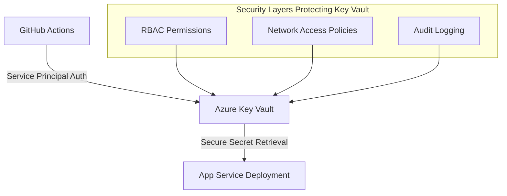

# Day 23: DevSecOps & CI/CD Security

**Date**: September 26, 2025  
**Focus**: Secure automated deployment pipelines with GitHub Actions  
**Strategic Context**: Portfolio-focused approach (CPF certification funding unavailable)

---

## 🎯 Learning Objectives

### **Primary Goals**
1. **GitHub Actions Security** - Implement secure CI/CD workflows
2. **Secrets Management** - Azure Key Vault integration with GitHub
3. **Automated Security Scanning** - SAST, dependency checks, container scanning
4. **Security Gates** - Prevent insecure deployments through automated controls
5. **Infrastructure as Code Security** - Secure Bicep template deployment

### **Portfolio Value**
- **Demonstrable DevSecOps Skills** - Show employers you understand modern security practices
- **Real-World Implementation** - Not just theoretical knowledge
- **Cost-Conscious Security** - Prove you can secure systems within budget constraints
- **GitHub Portfolio Enhancement** - Visible security practices in your repositories

---

## 📋 Current Environment Assessment

### **Available Resources**
- ✅ **Azure Subscription** - Free tier with existing App Service
- ✅ **GitHub Repository** - cybersecurity-journey (public visibility)
- ✅ **Azure CLI** - Configured and authenticated
- ✅ **Key Vault** - From Day 17 work (secrets management ready)
- ✅ **App Service** - `app-secureapp-dev-rubf4v` (deployment target)

### **Security Integration Points**
- **Azure Service Principal** - For GitHub Actions authentication
- **Key Vault Integration** - Secure secrets access during deployment
- **Security Scanning** - Automated vulnerability detection
- **Deployment Gates** - Security approval workflows

---

## 🔐 Phase 1: Secure Service Principal Setup

### **Why Service Principals Matter**
In enterprise DevSecOps, you **never** use personal credentials in CI/CD pipelines. Service Principals provide:
- **Principle of Least Privilege** - Minimal required permissions only
- **Credential Rotation** - Regular security key updates
- **Audit Trail** - Clear logging of automated actions
- **Separation of Concerns** - CI/CD identity separate from user identity

### **Service Principal Security Best Practices**
```bash
# Create service principal with minimal required permissions
az ad sp create-for-rbac \
  --name "github-actions-devsecops" \
  --role "contributor" \
  --scopes "/subscriptions/$SUBSCRIPTION_ID/resourceGroups/rg-learning-day1" \
  --sdk-auth

# Key Security Considerations:
# 1. Scoped to specific resource group (not entire subscription)
# 2. Minimal role assignment (contributor, not owner)
# 3. SDK-auth format for GitHub Actions compatibility
# 4. Descriptive naming for audit purposes
```

### **Expected Output Structure**
```json
{
  "clientId": "<service-principal-app-id>",
  "clientSecret": "<service-principal-password>",
  "subscriptionId": "<subscription-id>",
  "tenantId": "<tenant-id>"
}
```

**Security Note**: This credential will be stored as GitHub encrypted secret, never committed to code.

---

## 🔍 Phase 2: GitHub Actions Security Architecture

### **Secure Workflow Design Principles**

#### **1. Environment Separation**
```yaml
# Separate environments with different security requirements
environments:
  development:
    protection_rules: []  # Minimal restrictions for dev
  staging:
    protection_rules:
      - required_reviewers: 1  # Security review required
  production:
    protection_rules:
      - required_reviewers: 2  # Multiple approvers
      - wait_timer: 5         # Cooling-off period
```

#### **2. Secret Management Hierarchy**
```
Repository Secrets (High Security):
├── AZURE_CREDENTIALS (Service Principal JSON)
├── KEY_VAULT_NAME (Azure Key Vault reference)
└── SUBSCRIPTION_ID (Azure subscription identifier)

Environment Secrets (Per-stage):
├── dev/ → APP_SERVICE_NAME_DEV
├── staging/ → APP_SERVICE_NAME_STAGING
└── prod/ → APP_SERVICE_NAME_PROD
```

#### **3. Security Scanning Integration**
- **SAST (Static Analysis)** - CodeQL for code vulnerability scanning
- **Dependency Scanning** - Automated outdated/vulnerable package detection
- **Container Scanning** - Docker image vulnerability assessment
- **Infrastructure Scanning** - Bicep template security validation

---

## ⚡ Phase 3: Hands-On Implementation

### **Step 1: Service Principal Creation**

Let's create a properly scoped service principal for our DevSecOps pipeline:

```bash
# First, let's verify our current Azure context
az account show --output table

# Get our subscription ID for scoping
SUBSCRIPTION_ID=$(az account show --query id --output tsv)
echo "Subscription ID: $SUBSCRIPTION_ID"

# Create service principal scoped to our learning resource group
az ad sp create-for-rbac \
  --name "sp-github-actions-day23" \
  --role "Contributor" \
  --scopes "/subscriptions/$SUBSCRIPTION_ID/resourceGroups/rg-learning-day1" \
  --sdk-auth
```

**Security Benefits**:
- ✅ **Scoped Access** - Only our learning resource group, not entire subscription
- ✅ **Minimal Permissions** - Contributor role, not Owner
- ✅ **Audit-Friendly** - Clear naming convention for tracking
- ✅ **Rotation-Ready** - Can be regenerated without affecting other systems

### **Step 2: GitHub Repository Security Configuration**

After creating the service principal, we'll configure GitHub repository secrets:

1. **Navigate to**: Repository → Settings → Secrets and variables → Actions
2. **Add Repository Secrets**:
   - `AZURE_CREDENTIALS`: Full JSON output from service principal creation
   - `KEY_VAULT_NAME`: Your Key Vault name from Day 17
   - `SUBSCRIPTION_ID`: Azure subscription identifier

### **Step 3: Secure Workflow Creation**

We'll create a multi-stage security-focused workflow:

```yaml
# .github/workflows/secure-deployment.yml
name: 'Secure DevSecOps Pipeline'

on:
  push:
    branches: [ main ]
    paths: 
      - 'azure-security-mastery/**'
  pull_request:
    branches: [ main ]

env:
  AZURE_WEBAPP_NAME: 'app-secureapp-dev-rubf4v'
  AZURE_WEBAPP_PACKAGE_PATH: '.'

jobs:
  security-scan:
    name: 'Security Scanning'
    runs-on: ubuntu-latest
    
    steps:
    - name: 'Checkout Code'
      uses: actions/checkout@v4
      
    - name: 'Initialize CodeQL'
      uses: github/codeql-action/init@v2
      with:
        languages: javascript, python
        
    - name: 'Run CodeQL Analysis'
      uses: github/codeql-action/analyze@v2
      
    - name: 'Dependency Vulnerability Scan'
      uses: actions/dependency-review-action@v3
      if: github.event_name == 'pull_request'

  infrastructure-security:
    name: 'Infrastructure Security Validation'
    runs-on: ubuntu-latest
    needs: security-scan
    
    steps:
    - name: 'Checkout Code'
      uses: actions/checkout@v4
      
    - name: 'Azure Login'
      uses: azure/login@v1
      with:
        creds: ${{ secrets.AZURE_CREDENTIALS }}
        
    - name: 'Validate Bicep Templates'
      run: |
        # Install Bicep
        az bicep install
        
        # Validate all Bicep templates for security issues
        find . -name "*.bicep" -exec az bicep build --file {} \;
        
    - name: 'Azure Security Baseline Check'
      run: |
        # Check current App Service security configuration
        az webapp config show \
          --name ${{ env.AZURE_WEBAPP_NAME }} \
          --resource-group rg-learning-day1 \
          --query '{httpsOnly: httpsOnly, minTlsVersion: minTlsVersion}' \
          --output table

  deploy-development:
    name: 'Deploy to Development'
    runs-on: ubuntu-latest
    needs: [security-scan, infrastructure-security]
    if: github.ref == 'refs/heads/main'
    
    steps:
    - name: 'Checkout Code'
      uses: actions/checkout@v4
      
    - name: 'Azure Login'
      uses: azure/login@v1
      with:
        creds: ${{ secrets.AZURE_CREDENTIALS }}
        
    - name: 'Retrieve Secrets from Key Vault'
      uses: azure/get-keyvault-secrets@v1
      with:
        keyvault: ${{ secrets.KEY_VAULT_NAME }}
        secrets: 'database-connection-string, api-key'
      id: keyvault-secrets
      
    - name: 'Deploy with Security Headers'
      run: |
        # Apply security configurations during deployment
        az webapp config set \
          --name ${{ env.AZURE_WEBAPP_NAME }} \
          --resource-group rg-learning-day1 \
          --min-tls-version "1.2" \
          --https-only true \
          --ftps-state "FtpsOnly"
```

---

## 🛡️ Phase 4: Security Scanning Deep Dive

### **Static Application Security Testing (SAST)**

#### **CodeQL Integration Benefits**
- **Language Coverage**: JavaScript, Python, Java, C#, C++, Go
- **Vulnerability Detection**: SQL injection, XSS, authentication bypasses
- **Zero Configuration**: Automatic language detection and analysis
- **GitHub Native**: Seamlessly integrated with repository security tab

#### **Custom Security Rules**
```yaml
# .github/codeql/custom-security-queries.ql
import javascript

from CallExpr call
where call.getCalleeName() = "eval"
select call, "Dangerous eval() usage detected - security risk"
```

### **Dependency Vulnerability Management**

#### **Automated Dependency Updates**
```yaml
# .github/dependabot.yml
version: 2
updates:
  - package-ecosystem: "npm"
    directory: "/"
    schedule:
      interval: "weekly"
    open-pull-requests-limit: 10
    
  - package-ecosystem: "pip"
    directory: "/"
    schedule:
      interval: "weekly"
    open-pull-requests-limit: 10
```

#### **Security-First Update Strategy**
- **Critical Vulnerabilities**: Automatic merging after CI passes
- **High Vulnerabilities**: Require security team review
- **Medium/Low**: Batched weekly updates
- **Major Version Updates**: Manual review required

---

## 🔒 Phase 5: Secrets Management Security

### **Azure Key Vault Integration Architecture**



### **Key Vault Security Best Practices**

#### **1. Least Privilege Access**
```bash
# Grant minimal required permissions to service principal
az keyvault set-policy \
  --name $KEY_VAULT_NAME \
  --spn $SERVICE_PRINCIPAL_ID \
  --secret-permissions get list
  
# Note: No create, update, delete permissions for CI/CD
```

#### **2. Network Security**
```bash
# Restrict Key Vault access to Azure services only
az keyvault network-rule add \
  --name $KEY_VAULT_NAME \
  --ip-address "0.0.0.0/0" \
  --action Deny
  
az keyvault update \
  --name $KEY_VAULT_NAME \
  --default-action Deny
```

#### **3. Audit and Monitoring**
```bash
# Enable Key Vault logging for security monitoring
az monitor diagnostic-settings create \
  --name "KeyVault-Security-Logging" \
  --resource $KEY_VAULT_ID \
  --logs '[{"category":"AuditEvent","enabled":true}]' \
  --workspace $LOG_ANALYTICS_WORKSPACE_ID
```

---

## 📊 Phase 6: Security Metrics and Monitoring

### **DevSecOps Security KPIs**

#### **Pipeline Security Metrics**
- **Mean Time to Security Fix (MTTSF)**: Average time from vulnerability detection to patch deployment
- **Security Gate Success Rate**: Percentage of deployments passing security scans
- **False Positive Rate**: Security scan alerts requiring manual triage
- **Secret Rotation Frequency**: How often credentials are updated

#### **Automated Security Reporting**
```yaml
# Security metrics collection step
- name: 'Generate Security Report'
  run: |
    echo "## Security Scan Results" >> security-report.md
    echo "- CodeQL: $(cat codeql-results.json | jq '.runs[0].results | length') issues found" >> security-report.md
    echo "- Dependencies: $(cat dependency-scan.json | jq '.vulnerabilities | length') vulnerabilities" >> security-report.md
    echo "- Infrastructure: Bicep validation passed" >> security-report.md
    
- name: 'Post Security Report'
  uses: actions/github-script@v6
  with:
    script: |
      const fs = require('fs');
      const report = fs.readFileSync('security-report.md', 'utf8');
      
      github.rest.issues.createComment({
        issue_number: context.issue.number,
        owner: context.repo.owner,
        repo: context.repo.repo,
        body: report
      });
```

---

## 🎯 Expected Learning Outcomes

### **Technical Skills Acquired**
- ✅ **Service Principal Management** - Secure automated authentication
- ✅ **GitHub Actions Security** - Enterprise-grade CI/CD pipelines
- ✅ **Secrets Management** - Azure Key Vault integration patterns
- ✅ **Security Scanning** - Automated vulnerability detection
- ✅ **Infrastructure Security** - Secure deployment practices

### **Portfolio Demonstration Value**
- **Employer Visibility** - Public GitHub repository showing security practices
- **Real-World Skills** - Not just theoretical knowledge
- **Cost Consciousness** - Efficient use of free tier resources
- **Security Mindset** - Defense-in-depth approach to CI/CD

### **Career Preparation**
- **DevSecOps Engineer** - Core competencies demonstrated
- **Cloud Security Analyst** - Practical Azure security implementation
- **Site Reliability Engineer** - Secure, automated operations
- **Security Consultant** - Comprehensive security assessment abilities

---

**Next Steps**: Ready to implement this secure DevSecOps pipeline hands-on? We'll start with the service principal creation and work through each security layer systematically.