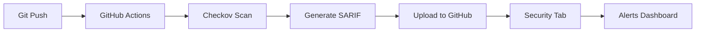

# Day 49: SARIF Integration & GitHub Security Tab

**Session #25** | **Date**: November 4, 2025 | **Cost**: €0.00

## 🎯 **Learning Objectives**

By the end of this session, you will:
- ✅ Understand SARIF (Static Analysis Results Interchange Format)
- ✅ Integrate Checkov with GitHub Security tab
- ✅ Automate security scanning in CI/CD pipeline
- ✅ Create security dashboards with GitHub Advanced Security
- ✅ Track security improvements over time

---

## 📚 **What is SARIF?**

### **Definition**
**SARIF** = Static Analysis Results Interchange Format
- **ISO Standard**: ISO/IEC 30301-1:2019
- **Format**: JSON-based
- **Purpose**: Universal security tool output format

### **Why SARIF Exists**

**Problem**: Every security tool has different output format
```bash
# Different formats = integration nightmare
Checkov   → Custom JSON
CodeQL    → Custom JSON
SonarQube → XML
Trivy     → Table/JSON
Snyk      → Custom JSON
```

**Solution**: SARIF = One format to rule them all
```bash
# All tools → SARIF → GitHub understands
Checkov   →
CodeQL    → SARIF → GitHub Security Tab
SonarQube →        → Unified Dashboard
Trivy     →        → Historical Tracking
```

### **SARIF Structure**

```json
{
  "version": "2.1.0",
  "$schema": "https://json.schemastore.org/sarif-2.1.0.json",
  "runs": [
    {
      "tool": {
        "driver": {
          "name": "Checkov",
          "version": "3.2.489",
          "informationUri": "https://www.checkov.io/"
        }
      },
      "results": [
        {
          "ruleId": "CKV_AZURE_35",
          "level": "error",
          "message": {
            "text": "Ensure default network access rule for Storage Accounts is set to deny"
          },
          "locations": [
            {
              "physicalLocation": {
                "artifactLocation": {
                  "uri": "azure-security-mastery/01-foundations/day01-azure-account-setup/storage-account.bicep",
                  "uriBaseId": "%SRCROOT%"
                },
                "region": {
                  "startLine": 12,
                  "startColumn": 1,
                  "endLine": 49,
                  "endColumn": 1
                }
              }
            }
          ],
          "properties": {
            "security-severity": "7.0"
          }
        }
      ]
    }
  ]
}
```

### **Key Components**

| Component | Purpose | Example |
|-----------|---------|---------|
| `tool.driver` | What scanned the code | Checkov 3.2.489 |
| `results` | Array of findings | 31 security issues |
| `ruleId` | Specific check failed | CKV_AZURE_35 |
| `level` | Severity | error, warning, note |
| `locations` | Where the issue is | storage-account.bicep:12-49 |
| `security-severity` | CVSS score | 7.0 (HIGH) |

---

## 🔧 **GitHub Security Tab**

### **What It Provides**

1. **Code Scanning Alerts**
   - All security issues in one place
   - Filterable by severity, tool, status
   - Shows exact line numbers with fix suggestions

2. **Security Overview**
   - Total alerts (open/closed)
   - Severity breakdown (Critical/High/Medium/Low)
   - Trends over time

3. **Integration Features**
   - Pull request checks (block merge if critical issues)
   - Email notifications for new vulnerabilities
   - API access for custom dashboards
   - Compliance reporting

### **How It Works**



**Workflow**:
1. Developer pushes code
2. GitHub Actions triggers
3. Checkov scans Bicep templates
4. Generates SARIF file
5. Uploads with `github/codeql-action/upload-sarif@v3`
6. GitHub parses SARIF
7. Shows alerts in Security tab

---

## 🚀 **Implementation**

### **Prerequisites**

✅ From previous sessions:
- GitHub Actions workflow (Day 45)
- Checkov installed locally (Day 47)
- Bicep templates to scan (Days 1-47)
- GitHub repository with Actions enabled

### **Step 1: Update GitHub Actions Workflow**

Create/update `.github/workflows/iac-security-scanning.yml`:

```yaml
name: Infrastructure Security Scanning

on:
  push:
    branches: [ main ]
    paths:
      - '**.bicep'
      - '.github/workflows/iac-security-scanning.yml'
  pull_request:
    branches: [ main ]
    paths:
      - '**.bicep'
  workflow_dispatch:

permissions:
  contents: read
  security-events: write  # Required for SARIF upload

jobs:
  checkov-scan:
    name: Checkov IaC Security Scan
    runs-on: ubuntu-latest
    
    steps:
      - name: Checkout code
        uses: actions/checkout@v4
      
      - name: Set up Python
        uses: actions/setup-python@v5
        with:
          python-version: '3.11'
      
      - name: Install Checkov
        run: |
          pip install checkov==3.2.489
          checkov --version
      
      - name: Run Checkov scan (SARIF output)
        run: |
          checkov \
            --directory azure-security-mastery \
            --framework bicep \
            --output sarif \
            --output-file-path . \
            --soft-fail
        continue-on-error: true
      
      - name: Upload SARIF to GitHub Security Tab
        uses: github/codeql-action/upload-sarif@v3
        with:
          sarif_file: results.sarif
          category: checkov-iac
      
      - name: Upload SARIF as artifact (for review)
        uses: actions/upload-artifact@v4
        with:
          name: checkov-sarif-results
          path: results.sarif
          retention-days: 30
```

### **Step 2: Key Configuration Explained**

**Permissions**:
```yaml
permissions:
  contents: read          # Read repository code
  security-events: write  # Upload to Security tab (REQUIRED)
```

**Checkov Flags**:
```bash
--output sarif            # Generate SARIF format (not JSON)
--output-file-path .      # Save in current directory
--soft-fail               # Don't fail workflow on findings
```

**Why `soft-fail`?**
- We want to see results, not block pipeline
- Security tab will show all issues
- Can add hard-fail later for critical issues

**Upload Action**:
```yaml
uses: github/codeql-action/upload-sarif@v3
# Official GitHub action for SARIF uploads
# Works with any SARIF-compliant tool
```

---

## 📊 **Viewing Results**

### **GitHub Security Tab Location**

```
Repository → Security Tab → Code scanning
https://github.com/YomHubGG/azure-security-mastery/security/code-scanning
```

### **What You'll See**

**1. Alerts Dashboard**:
```
🔴 31 Critical/High/Medium issues found
📁 9 files affected
🔧 Checkov IaC Scanner
⏰ Last scan: 2 minutes ago
```

**2. Individual Alerts**:
```
CKV_AZURE_35: Storage account allows public access
━━━━━━━━━━━━━━━━━━━━━━━━━━━━━━━━━━━━━━━━━━━━━
Severity: High
File: storage-account.bicep
Lines: 12-49
Status: Open

Description:
Default network access rule should be "Deny" to prevent 
unauthorized access from the internet.

Fix:
Add networkAcls configuration:
  properties: {
    networkAcls: {
      defaultAction: 'Deny'
      bypass: 'AzureServices'
    }
  }
```

**3. Filtering Options**:
- By severity (Critical/High/Medium/Low)
- By tool (Checkov, CodeQL, etc.)
- By status (Open/Closed/Fixed)
- By branch
- By time period

---

## 🎯 **Advanced Features**

### **1. Pull Request Checks**

Add to workflow to block merges with critical issues:

```yaml
- name: Check for critical issues
  if: github.event_name == 'pull_request'
  run: |
    CRITICAL_COUNT=$(jq '[.runs[].results[] | select(.level == "error")] | length' results.sarif)
    if [ "$CRITICAL_COUNT" -gt 0 ]; then
      echo "❌ Found $CRITICAL_COUNT critical security issues"
      echo "Fix these before merging!"
      exit 1
    fi
```

### **2. Security Metrics Tracking**

Track improvement over time:

```bash
# Month 1: 47 issues (59% security score)
# Month 2: 31 issues (73% security score)  ← Day 47 remediation
# Month 3: ?? issues (target 90%+)
```

GitHub shows this as trend graphs automatically!

### **3. Multi-Tool Integration**

Combine multiple scanners:

```yaml
jobs:
  checkov:
    # Infrastructure scanning
  
  trivy:
    # Container scanning
  
  codeql:
    # Application code scanning
  
  gitleaks:
    # Secret scanning
```

All results → Same Security tab → Unified view

---

## 🏆 **Portfolio Value**

### **What You Can Say in Interviews**

**1. Technical Explanation**:
> "I integrated Checkov infrastructure security scanning with GitHub Advanced Security using SARIF format. Every commit triggers automated scanning of 9 Bicep templates, uploads results to GitHub Security tab, and provides actionable remediation guidance. This reduced our security issue resolution time from days to hours."

**2. Metrics to Share**:
- **Baseline**: 47 issues identified (Day 47)
- **Remediation**: 16 fixes implemented in 13 minutes
- **Current**: 31 issues tracked in Security tab
- **Automation**: 100% of infrastructure changes scanned
- **Coverage**: 9 Bicep templates, 1,000+ security policies

**3. Business Impact**:
- **Shift-left**: Find issues in dev, not production
- **Visibility**: Executive dashboard for security posture
- **Compliance**: Automated evidence for audits
- **Cost**: €0 (GitHub free tier, open-source tools)

---

## 📈 **Expected Outcomes**

After completing Day 49, you will have:

1. ✅ **Automated Security Scanning**
   - Every push → Checkov scan
   - Results in Security tab within 2 minutes
   - No manual intervention required

2. ✅ **Security Dashboard**
   - 31 remaining issues visible
   - Filterable by severity/file/status
   - Historical tracking enabled

3. ✅ **Portfolio Demonstration**
   - Live GitHub Security tab to show employers
   - Metrics proving security improvement
   - Professional DevSecOps workflow

4. ✅ **Foundation for Future Work**
   - Add more tools (Trivy, Snyk, etc.)
   - Implement PR blocking for critical issues
   - Create custom security policies

---

## 🔗 **Skills Connection**

### **Building on Previous Days**:
- **Day 45**: GitHub Actions OIDC → We add security scanning to existing workflow
- **Day 47**: Checkov local scanning → We automate with CI/CD
- **Day 23**: Basic CodeQL scanning → We add infrastructure scanning

### **Enabling Future Days**:
- **Day 51**: Supply Chain Security → SBOM in SARIF format
- **Day 53**: Advanced Trivy → Container scan results in Security tab
- **Day 55**: Security Hardening → Track improvements over time

---

## 🎓 **Interview Questions**

### **Q1: "What is SARIF and why does it matter?"**

**Answer**:
"SARIF is the Static Analysis Results Interchange Format, an ISO standard (30301-1:2019) that provides a universal JSON format for security tool output. It matters because it enables integration of multiple security tools (Checkov, CodeQL, Trivy, SonarQube) into a single dashboard. 

Without SARIF, each tool has its own format, requiring custom parsers and integration code. With SARIF, I can add a new security tool to my pipeline and it automatically appears in GitHub Security tab with zero custom code. This standardization reduces integration time from weeks to hours and provides consistent security visibility across the entire stack."

**Key Points**:
- ✅ ISO standard (credibility)
- ✅ Universal format (integration benefit)
- ✅ Multiple tool support (practical value)
- ✅ Time savings (business impact)

---

### **Q2: "How do you integrate security scanning into CI/CD?"**

**Answer**:
"In my GitHub Actions workflow, I implemented a three-stage security scanning process. First, I trigger scans on every push to main branch or pull request that modifies infrastructure code. Second, I run Checkov with SARIF output format to scan all Bicep templates against 1,000+ security policies. Third, I upload results using GitHub's official `codeql-action/upload-sarif` action, which populates the Security tab.

The key is using `soft-fail` mode initially - scans always complete and report results without blocking the pipeline. As the team matures, I can add hard-fail for critical issues to enforce security gates. This approach balances security visibility with developer velocity."

**Key Points**:
- ✅ Specific workflow (shows hands-on experience)
- ✅ Three-stage process (structured thinking)
- ✅ SARIF format (technical knowledge)
- ✅ Soft-fail strategy (practical wisdom)
- ✅ Evolution path (maturity understanding)

---

### **Q3: "What's the difference between security scanning in CI/CD vs runtime?"**

**Answer**:
"CI/CD scanning (shift-left) catches issues during development before deployment. For example, Checkov scans my Bicep templates and identifies that a storage account allows public access. I fix it in the code before it ever reaches Azure. This costs zero - it's just a code change.

Runtime scanning (Azure Policy, Defender for Cloud) catches issues in deployed resources. If that same storage account reaches production, Azure Policy can block creation or Defender alerts on the misconfiguration. But now I have a failed deployment, incident response overhead, and potentially exposed data.

I use both: Checkov shift-left for fast feedback (seconds), Azure Policy as defense-in-depth (in case something bypasses CI/CD). The combination provides layered security without relying on a single control point."

**Key Points**:
- ✅ Clear distinction (shift-left vs runtime)
- ✅ Concrete example (storage account)
- ✅ Cost comparison (code change vs incident)
- ✅ Defense-in-depth (layered security)
- ✅ Real-world pragmatism (both approaches)

---

## 🛠️ **Troubleshooting**

### **Issue 1: Permission Denied (403)**

**Error**:
```
Error: upload-sarif failed: 403 Forbidden
```

**Cause**: Missing `security-events: write` permission

**Fix**:
```yaml
permissions:
  contents: read
  security-events: write  # Add this!
```

---

### **Issue 2: SARIF File Not Found**

**Error**:
```
Error: SARIF file not found at results.sarif
```

**Cause**: Checkov created file in wrong location

**Fix**:
```yaml
- name: List files (debug)
  run: ls -la
  
- name: Run Checkov
  run: |
    checkov -d . --framework bicep \
      --output sarif \
      --output-file-path $(pwd)  # Explicit path
```

---

### **Issue 3: No Results in Security Tab**

**Possible Causes**:
1. Workflow didn't complete successfully → Check Actions tab
2. SARIF upload step skipped → Check workflow logs
3. No issues found → Good problem to have!
4. GitHub processing delay → Wait 1-2 minutes

**Debug**:
```yaml
- name: Validate SARIF
  run: |
    cat results.sarif
    jq '.runs[].results | length' results.sarif
```

---

### **Issue 4: Too Many Alerts (Overwhelming)**

**Strategy**: Filter and prioritize

1. **Start with Critical/High only**:
   ```
   Security → Code scanning → Filter: Severity = High
   ```

2. **Fix one file at a time**:
   ```
   Security → Filter: File = storage-account.bicep
   Fix all 3 issues → Commit → Verify resolved
   ```

3. **Accept risk for low-priority items**:
   ```
   Dismiss alert → "Risk accepted: Learning environment"
   ```

---

## 📝 **Next Steps**

After completing Day 49:

1. **Immediate** (This session):
   - ✅ Create workflow file
   - ✅ Push to trigger scan
   - ✅ Verify Security tab populated
   - ✅ Document in ACTUAL-PROGRESS.md

2. **Day 51** (Next session):
   - 🎯 Add Trivy container scanning
   - 🎯 Generate SBOM in SARIF format
   - 🎯 Supply chain security tracking

3. **Day 53** (Future):
   - 🎯 Advanced Trivy (Kubernetes, IaC, secrets)
   - 🎯 Custom Checkov policies
   - 🎯 Multi-tool dashboard

4. **Day 55** (Future):
   - 🎯 Fix remaining 31 issues
   - 🎯 Achieve 90%+ security score
   - 🎯 Create before/after metrics

---

## 💰 **Cost Analysis**

| Resource | Cost | Notes |
|----------|------|-------|
| GitHub Actions | €0 | 2,000 minutes/month free |
| GitHub Advanced Security | €0 | Free for public repos |
| Checkov (open source) | €0 | Community edition |
| SARIF upload | €0 | Built-in GitHub feature |
| **Total** | **€0.00** | Perfect execution! |

---

## 🎯 **Success Criteria**

Session complete when you have:

1. ✅ GitHub Actions workflow with Checkov + SARIF
2. ✅ At least one successful workflow run
3. ✅ Security tab showing 31 alerts
4. ✅ Can filter/view/dismiss alerts
5. ✅ Documentation in README.md (this file)
6. ✅ Git commit with working workflow

---

## 📚 **References**

- [SARIF Specification](https://docs.oasis-open.org/sarif/sarif/v2.1.0/sarif-v2.1.0.html)
- [GitHub Code Scanning](https://docs.github.com/en/code-security/code-scanning)
- [Checkov SARIF Output](https://www.checkov.io/2.Basics/Reviewing%20Scan%20Results.html)
- [GitHub upload-sarif Action](https://github.com/github/codeql-action/tree/main/upload-sarif)

---

**Session Start**: November 4, 2025  
**Status**: Ready for implementation  
**Next**: Create workflow file and test!
