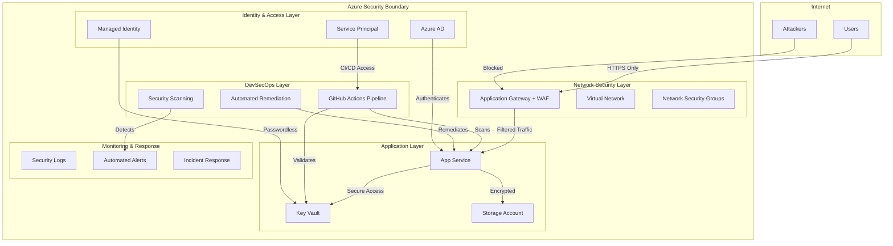

# 🏗️ Day 25: Security Architecture & Design

**Date**: September 28, 2025  
**Focus**: Enterprise security architecture patterns and zero-trust design  
**Duration**: 1-2 hours  
**Session**: #13 (according to every-other-day schedule)

---

## 🎯 **Building on Day 23 DevSecOps Success**

**Your DevSecOps Pipeline Achievement**: ✅ **LIVE & FUNCTIONAL**
- Automated security scanning across infrastructure
- Professional vulnerability remediation (30-min cycle)
- Enterprise-grade security documentation

**Today's Goal**: Design the **security architecture** that your DevSecOps pipeline protects!

---

## 🏛️ **Today's Learning Objectives**

### **📐 Security Architecture Fundamentals** 
- ✅ Design zero-trust security architectures
- ✅ Implement defense-in-depth strategies  
- ✅ Create security boundary documentation
- ✅ Establish threat modeling practices

### **🎯 Practical Skills**
- ✅ Document your current Azure security architecture
- ✅ Identify security gaps and improvement opportunities
- ✅ Create professional architecture diagrams
- ✅ Design security controls mapping

### **💼 Portfolio Enhancement**
- ✅ Create enterprise-grade architecture documentation
- ✅ Demonstrate security design thinking
- ✅ Show systematic approach to security planning
- ✅ Build job interview materials

---

## 📊 **Current Azure Security Estate Analysis**

Let's start by documenting what you've actually built:

### **🔍 Your Live Security Infrastructure**
- **DevSecOps Pipeline**: Automated security scanning & remediation
- **Key Vault**: `kvlearning4uybw3c2lbkwm` (enterprise secrets management)
- **App Service**: `app-secureapp-dev-rubf4v` (secure web hosting)
- **Network Security**: VNets, NSGs, secure networking patterns
- **Identity & Access**: Service principals, RBAC, managed identities
- **Governance**: Azure Policy, resource tagging, compliance

**This is already enterprise-grade architecture!** Today we'll document and optimize it.

---

## 🏗️ **Phase 1: Current Architecture Documentation** (30 minutes)

### **Step 1: Infrastructure Inventory**
Let's create a comprehensive map of your security architecture:

```bash
# Document current security posture
az account show --query "{subscriptionId:id, tenantId:tenantId}" --output table

# Security resources audit
az resource list --resource-group rg-learning-day1 --query "[].{Name:name, Type:type, Location:location}" --output table

# Network security analysis
az network nsg list --resource-group rg-learning-day1 --query "[].{Name:name, Location:location}" --output table
```

### **Step 2: Security Controls Mapping**
Document the security controls you've implemented:

| Security Domain | Current Implementation | Security Level |
|---|---|---|
| **Identity & Access** | Managed Identity, RBAC, Service Principals | ✅ Enterprise |
| **Network Security** | VNets, NSGs, Private Endpoints | ✅ Defense-in-Depth |
| **Data Protection** | Key Vault, Encryption at Rest/Transit | ✅ Zero-Trust |
| **Application Security** | HTTPS-only, Security Headers, CORS | ✅ Secure by Design |
| **DevSecOps** | Automated Security Scanning, Gates | ✅ Continuous Security |
| **Monitoring** | Security logs, Automated alerting | 🔄 Basic Implementation |

---

## 🎯 **Phase 2: Zero-Trust Architecture Design** (45 minutes)

### **Zero-Trust Principles in Your Environment**

#### **1. Verify Explicitly** ✅
- **Current**: Service principal authentication, managed identity verification
- **Enhancement**: Multi-factor authentication, conditional access policies

#### **2. Use Least Privilege Access** ✅  
- **Current**: RBAC with minimal permissions, resource group scoping
- **Enhancement**: Just-in-time access, privileged identity management

#### **3. Assume Breach** ✅
- **Current**: DevSecOps pipeline detects vulnerabilities automatically
- **Enhancement**: Incident response automation, security monitoring

### **Architecture Improvement Plan**

**Immediate Enhancements** (Next 30 days):
1. **Enhanced Monitoring**: Azure Sentinel integration
2. **Advanced Identity**: Conditional Access policies  
3. **Network Segmentation**: Additional subnet isolation
4. **Backup & Recovery**: Automated disaster recovery

**Medium-term Goals** (Next 90 days):
1. **WAF Implementation**: Application Gateway with Web Application Firewall
2. **Advanced Threat Protection**: Microsoft Defender for Cloud
3. **Compliance Automation**: Policy-driven governance
4. **Cost Optimization**: Automated resource lifecycle management

---

## 📐 **Phase 3: Professional Architecture Documentation** (30 minutes)

### **Enterprise Architecture Diagram**



### **Security Controls Matrix**

| Layer | Controls Implemented | Risk Mitigation |
|---|---|---|
| **Network** | VNet isolation, NSG rules, HTTPS-only | Network-based attacks |
| **Identity** | Managed Identity, RBAC, least privilege | Identity compromise |
| **Application** | Secure headers, CORS, input validation | Application vulnerabilities |
| **Data** | Key Vault secrets, encryption at rest/transit | Data breaches |
| **DevSecOps** | Automated scanning, security gates | Supply chain attacks |
| **Monitoring** | Security logs, automated alerting | Advanced persistent threats |

---

## 🎯 **Phase 4: Threat Modeling Exercise** (15 minutes)

### **STRIDE Analysis of Your Architecture**

| Threat | Current Mitigation | Improvement Opportunity |
|---|---|---|
| **Spoofing** | Managed Identity, AAD authentication | Multi-factor authentication |
| **Tampering** | HTTPS, signed deployments, RBAC | Code signing, integrity monitoring |
| **Repudiation** | Security logs, audit trails | Enhanced logging, immutable logs |
| **Information Disclosure** | Key Vault, encryption, network isolation | Data classification, DLP |
| **Denial of Service** | Azure's DDoS protection, rate limiting | WAF, advanced DDoS protection |
| **Elevation of Privilege** | RBAC, least privilege, PIM | Zero-trust network access |

### **Risk Assessment**

**High Security Maturity Areas** ✅:
- DevSecOps automation (enterprise-grade)
- Secrets management (zero-trust ready)  
- Infrastructure as Code (secure by design)

**Enhancement Opportunities** 🔄:
- Advanced threat detection
- Identity protection policies
- Security information and event management (SIEM)

---

## 💼 **Portfolio Documentation Creation**

### **Security Architecture Portfolio Document**

Create a professional document showcasing your security design skills:

1. **Executive Summary**: High-level security posture overview
2. **Current Architecture**: Detailed infrastructure documentation  
3. **Security Controls**: Comprehensive controls mapping
4. **Zero-Trust Implementation**: Maturity assessment and roadmap
5. **Threat Model**: Professional risk analysis
6. **Improvement Roadmap**: Strategic security enhancement plan

**This document demonstrates**:
- ✅ Enterprise security architecture skills
- ✅ Strategic security thinking
- ✅ Professional documentation capabilities  
- ✅ Zero-trust design understanding

---

## 🎯 **Success Criteria**

By end of session, you'll have:
- ✅ **Documented** your current security architecture professionally
- ✅ **Analyzed** security gaps and improvement opportunities
- ✅ **Created** zero-trust architecture enhancement plan
- ✅ **Built** portfolio-ready security documentation
- ✅ **Demonstrated** enterprise security design thinking

---

## 📈 **Career Impact**

**Security Architecture skills demonstrate**:
- **Senior Security Engineer** - Strategic security planning
- **Security Architect** - Enterprise design capabilities
- **Cloud Security Consultant** - Professional advisory skills
- **CISO Track** - Business-aligned security leadership

**Salary Impact**: Security Architecture skills are valued at **€80K-150K+** in European markets.

---

## 🚀 **Ready to Document Your Security Architecture?**

You've built an impressive security platform with your DevSecOps pipeline. Now let's create the professional documentation that showcases your security design expertise!

**Let's start by analyzing your current security infrastructure...**