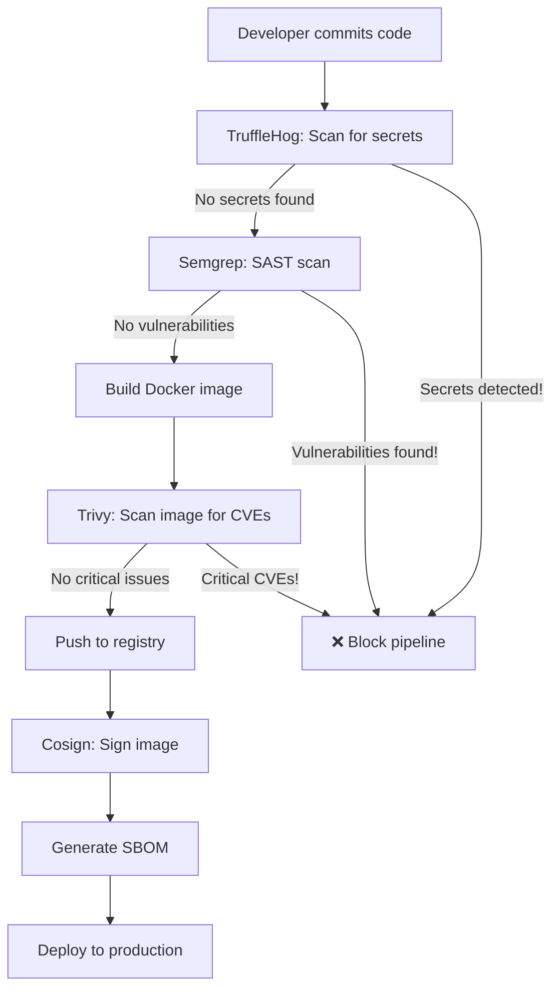

# 🛡️ CI/CD Security Tools - The Big Four

*Understanding the security scanning tools in our DevSecOps pipeline*

---

## 🎯 Why Four Different Tools?

Each tool specializes in finding **different types of security issues** at **different stages** of the development lifecycle:

| Tool | What It Finds | Stage | Why It Matters |
|------|--------------|-------|----------------|
| **TruffleHog** | Secrets & credentials | Pre-commit | Prevents leaked API keys |
| **Semgrep** | Code vulnerabilities | Source code | Catches bugs before build |
| **Trivy** | Container vulnerabilities | Image scanning | Finds OS/package issues |
| **Cosign** | Image verification | Post-build | Proves image authenticity |

Think of it like airport security: passport check → metal detector → baggage scan → boarding verification. Each catches different threats!

---

## 1️⃣ TruffleHog - Secret Scanning

### 🔍 What It Does
Searches for **hardcoded secrets** in your code:
- API keys (AWS, Azure, GitHub)
- Passwords in plain text
- Private keys (RSA, SSH)
- Database connection strings
- OAuth tokens

### 🎯 Why It's Critical
**Real-world disaster scenario:**
```javascript
// DON'T DO THIS! ❌
const apiKey = "sk-1234567890abcdef";  // TruffleHog will catch this!

// Instead: ✅
const apiKey = process.env.AZURE_API_KEY;  // Load from environment
```

**What happens if secrets leak:**
1. Attacker finds your AWS key in public GitHub repo
2. Spins up 100 GPU instances for crypto mining
3. Your credit card gets charged $50,000
4. Real story: [Uber $100k AWS bill from leaked key](https://www.theregister.com/2017/11/28/uber_aws_key_leak/)

### 📊 In Our Pipeline
```yaml
- name: Secret Scanning
  uses: trufflesecurity/trufflehog@main
  with:
    path: ./
    base: main
    head: HEAD
```

**Output Example:**
```
🔴 HIGH severity: AWS Access Key ID found
   File: config/database.js:12
   Secret: AKIA4... (redacted)
```

### 🛠️ How to Fix
1. **Remove secret from code**
2. **Revoke the compromised credential** (Azure Portal / AWS Console)
3. **Use Key Vault or GitHub Secrets** instead
4. **Add to `.gitignore`** to prevent future commits

---

## 2️⃣ Semgrep - Static Application Security Testing (SAST)

### 🔍 What It Does
Analyzes **source code** for security vulnerabilities and bad patterns:
- SQL injection vulnerabilities
- Cross-Site Scripting (XSS)
- Insecure randomness
- Hardcoded credentials (overlaps with TruffleHog)
- Dangerous function usage

### 🎯 Why It's Critical
**Catches vulnerabilities BEFORE they reach production:**

```javascript
// ❌ SQL Injection - Semgrep catches this!
const query = `SELECT * FROM users WHERE id = ${userId}`;

// ✅ Parameterized query
const query = 'SELECT * FROM users WHERE id = ?';
db.query(query, [userId]);
```

**Another example:**
```javascript
// ❌ XSS vulnerability
app.get('/search', (req, res) => {
  res.send(`Results for: ${req.query.q}`);  // User input not sanitized!
});

// ✅ Safe version
app.get('/search', (req, res) => {
  res.send(`Results for: ${escapeHtml(req.query.q)}`);
});
```

### 📊 In Our Pipeline
```yaml
- name: Run Semgrep
  uses: semgrep/semgrep-action@v1
  with:
    config: >-
      p/security-audit
      p/secrets
      p/owasp-top-ten
```

**Output Example:**
```
⚠️  MEDIUM: Detected SQL injection vulnerability
   Rule: javascript.express.security.audit.express-sql-injection
   File: app/routes/users.js:45
   
   45 |   const query = `SELECT * FROM users WHERE email = '${email}'`;
      |                 ^^^^^^^^^^^^^^^^^^^^^^^^^^^^^^^^^^^^^^^^^^^^^^^^
   
   Fix: Use parameterized queries or an ORM
```

### 🎓 Learning Resources
- **OWASP Top 10**: https://owasp.org/www-project-top-ten/
- **Semgrep Playground**: https://semgrep.dev/playground

---

## 3️⃣ Trivy - Container Vulnerability Scanner

### 🔍 What It Does
Scans **container images** for:
- Known CVEs (Common Vulnerabilities and Exposures)
- Outdated packages (npm, pip, apt)
- Misconfigurations
- Embedded secrets (another layer!)

### 🎯 Why It's Critical
**Your code might be secure, but dependencies aren't:**

```dockerfile
FROM node:16-alpine  # ❌ OLD VERSION with known CVEs!

# Trivy reports:
# CVE-2023-44487: HTTP/2 Rapid Reset Attack
# CRITICAL severity, update to node:18-alpine
```

**Real-world impact:**
- **Log4Shell (CVE-2021-44228)**: Affected millions of Java apps
- **Heartbleed (CVE-2014-0160)**: 17% of internet servers vulnerable
- Using outdated images = shipping known vulnerabilities

### 📊 In Our Pipeline
```yaml
- name: Run Trivy vulnerability scanner
  uses: aquasecurity/trivy-action@master
  with:
    image-ref: ${{ env.IMAGE_NAME }}:${{ github.sha }}
    format: 'sarif'
    output: 'trivy-results.sarif'
    severity: 'CRITICAL,HIGH'
```

**Output Example:**
```
TARGET: node_modules/express (npm)
├─ CRITICAL: CVE-2024-29041
│  Package: express
│  Version: 4.17.1
│  Fixed: 4.19.2
│  Description: Open redirect vulnerability
│
└─ HIGH: CVE-2024-43796
   Package: express
   Version: 4.17.1
   Fixed: 4.20.0
   Description: XSS via response type sniffing
```

### 🛠️ How to Fix
```dockerfile
# Update base image
FROM node:18-alpine  # ✅ Latest LTS

# Update packages
RUN npm audit fix --production
```

### 🎓 Vulnerability Databases
- **National Vulnerability Database**: https://nvd.nist.gov/
- **GitHub Advisory Database**: https://github.com/advisories
- **Trivy DB**: Updated daily with latest CVEs

---

## 4️⃣ Cosign - Image Signing & Verification

### 🔍 What It Does
**Cryptographically signs** container images to prove:
- ✅ Image came from YOUR pipeline (authenticity)
- ✅ Image hasn't been tampered with (integrity)
- ✅ Image was built by authorized CI/CD (non-repudiation)

### 🎯 Why It's Critical
**Supply chain attack scenario:**

```bash
# Attacker compromises Docker Hub account
docker push malicious-image:latest

# Your production pulls "latest" tag
docker pull your-app:latest  # ❌ Gets malicious image!

# With Cosign verification: ✅
cosign verify your-app:latest --certificate-identity=...
# Error: signature verification failed - BLOCKS deployment!
```

**Real-world attacks:**
- **SolarWinds (2020)**: Malicious code injected into software updates
- **Codecov (2021)**: Bash uploader script compromised
- **ua-parser-js npm (2021)**: 8M downloads, cryptominer injected

### 📊 In Our Pipeline
```yaml
- name: Sign image with Cosign
  run: |
    cosign sign --yes \
      --key env://COSIGN_PRIVATE_KEY \
      ${{ env.IMAGE_NAME }}:${{ github.sha }}
```

**What happens:**
1. Cosign generates a signature using your private key
2. Signature is stored alongside the image (in OCI registry)
3. Anyone can verify with your public key:
   ```bash
   cosign verify --key cosign.pub ghcr.io/yomhubgg/securecloud-devsecops:latest
   ```

### 🔐 Keyless Signing (What We Use)
No need to manage keys! Uses **OIDC tokens**:
- GitHub Actions proves identity via OIDC
- Sigstore (transparency log) records the signature
- Public transparency log = anyone can audit

```yaml
- name: Sign with keyless Cosign
  run: cosign sign --yes ${{ env.IMAGE_NAME }}:${{ github.sha }}
  env:
    COSIGN_EXPERIMENTAL: 1  # Enables keyless signing
```

### 🎓 Sigstore Ecosystem
- **Cosign**: Signing tool
- **Rekor**: Transparency log (like blockchain for signatures)
- **Fulcio**: Certificate authority for code signing
- Learn more: https://www.sigstore.dev/

---

## 🔗 How They Work Together

### Complete Security Pipeline Flow



### Defense in Depth Strategy

| Layer | Tool | What If It Fails? |
|-------|------|-------------------|
| **1. Secrets** | TruffleHog | Leaked credentials → Account compromise |
| **2. Code** | Semgrep | SQL injection → Database breach |
| **3. Dependencies** | Trivy | Vulnerable packages → Remote code execution |
| **4. Supply Chain** | Cosign | Malicious image → Full system compromise |

**Why all four?** Because attackers only need **ONE** weakness to exploit!

---

## 📊 Our Pipeline Security Metrics

### Day 59 Q2 Capstone Results

```yaml
Pipeline Run: #19362139258
Status: ✅ SUCCESS (after 13 debugging iterations)

Security Scans:
  - TruffleHog: ✅ No secrets detected
  - Semgrep:    ✅ No vulnerabilities (OWASP Top 10 checked)
  - Trivy:      ✅ No CRITICAL/HIGH CVEs
  - Cosign:     ✅ Image signed successfully

Artifacts:
  - SBOM (CycloneDX): ✅ Generated
  - SARIF reports:    ✅ Uploaded to GitHub Security
  - Signed image:     ✅ ghcr.io/yomhubgg/securecloud-devsecops:latest
```

### What This Means for Interviews

**Interviewer:** "How do you ensure container security?"

**You:** "I implement a 4-layer defense-in-depth approach:
1. **TruffleHog** prevents secret leaks before commit
2. **Semgrep** catches OWASP Top 10 vulnerabilities in code
3. **Trivy** scans for CVEs in dependencies and base images
4. **Cosign** signs images for supply chain integrity

Plus I generate SBOMs for transparency and upload SARIF to GitHub Security for centralized tracking."

---

## 🎓 Going Deeper

### Recommended Learning Path

**Week 1: Understand the threats**
- Read about real security breaches
- Study OWASP Top 10
- Learn about supply chain attacks

**Week 2: Tools deep-dive**
- Run each tool locally
- Intentionally create vulnerabilities to see how they're detected
- Configure custom rules in Semgrep

**Week 3: Integration**
- Add to GitHub Actions
- Set up SARIF uploads
- Implement security gates (fail on HIGH/CRITICAL)

**Week 4: Advanced**
- Policy enforcement with Open Policy Agent
- Runtime security with Falco
- Security scoring with Scorecard

### 📚 Essential Resources

**Free Courses:**
- [GitHub Security Lab](https://securitylab.github.com/)
- [Aqua Security Academy](https://www.aquasec.com/academy/)
- [OWASP DevSlop](https://www.devslop.co/)

**Certifications:**
- CompTIA Security+ (entry level)
- Certified Kubernetes Security Specialist (CKS)
- GIAC Cloud Security Essentials (GCLD)

**Books:**
- "Container Security" by Liz Rice
- "Hacking APIs" by Corey Ball
- "The Phoenix Project" (DevOps mindset)

---

## 💡 Key Takeaways

### Remember These Numbers

- **TruffleHog**: Scans for 700+ secret types
- **Semgrep**: 2000+ built-in security rules
- **Trivy**: Checks against 180,000+ CVEs
- **Cosign**: Sigstore transparency log has 100M+ entries

### Security is NOT Optional

```plaintext
❌ "We'll add security later"
❌ "We're too small to be targeted"  
❌ "Security slows down development"

✅ "Security is built into our pipeline"
✅ "We catch issues before they reach production"
✅ "Our CI/CD is our first line of defense"
```

### The True Cost of Insecurity

| Scenario | Without Pipeline | With Pipeline |
|----------|------------------|---------------|
| **Leaked AWS key** | $50,000 bill | Blocked by TruffleHog |
| **SQL injection** | Data breach, GDPR fine | Caught by Semgrep |
| **Log4Shell** | Emergency patching | Trivy alerts before deploy |
| **Supply chain attack** | Ransomware deployment | Cosign verification fails |

---

## 🎯 Next Steps

### For Your Portfolio

1. **Document your pipeline** (like we did here!)
2. **Show security scan results** (screenshots of clean scans)
3. **Explain your reasoning** (why 4 tools, not just 1)
4. **Demonstrate fixes** (show before/after of vulnerability)

### For Interviews

**Prepare to answer:**
- "How do you secure CI/CD pipelines?"
- "What's the difference between SAST and SCA?"
- "How do you handle zero-day vulnerabilities?"
- "Explain supply chain attacks and mitigation"

### For Your Career

- **GitHub Security Alerts**: Enable Dependabot
- **Azure Security Center**: Learn Defender for Containers
- **Kubernetes**: Study Pod Security Standards
- **Compliance**: Understand SOC 2, ISO 27001

---

## 📝 Glossary

- **SAST**: Static Application Security Testing (analyzing source code)
- **DAST**: Dynamic Application Security Testing (testing running apps)
- **SCA**: Software Composition Analysis (checking dependencies)
- **SBOM**: Software Bill of Materials (inventory of components)
- **CVE**: Common Vulnerabilities and Exposures (standardized vulnerability ID)
- **SARIF**: Static Analysis Results Interchange Format (standard for tool output)
- **OIDC**: OpenID Connect (authentication protocol)
- **OCI**: Open Container Initiative (container standards)

---

*Created: November 14, 2025*  
*Part of Day 59 Q2 Capstone Execution*  
*Azure Security Mastery Journey - Session 30*

**Remember:** The best security tool is the one that catches problems **before** they reach production! 🛡️
